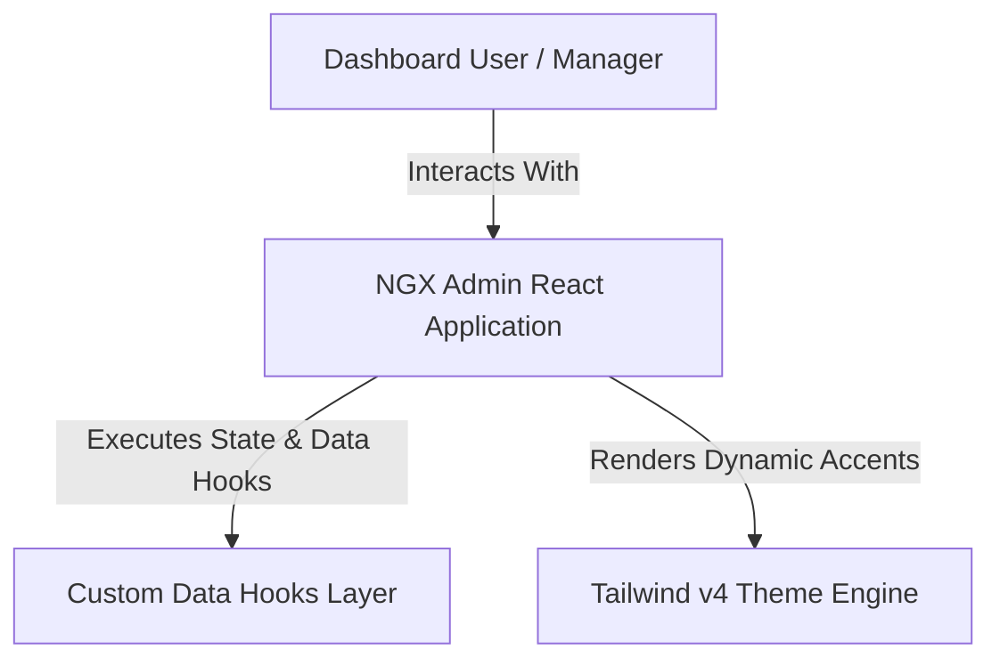
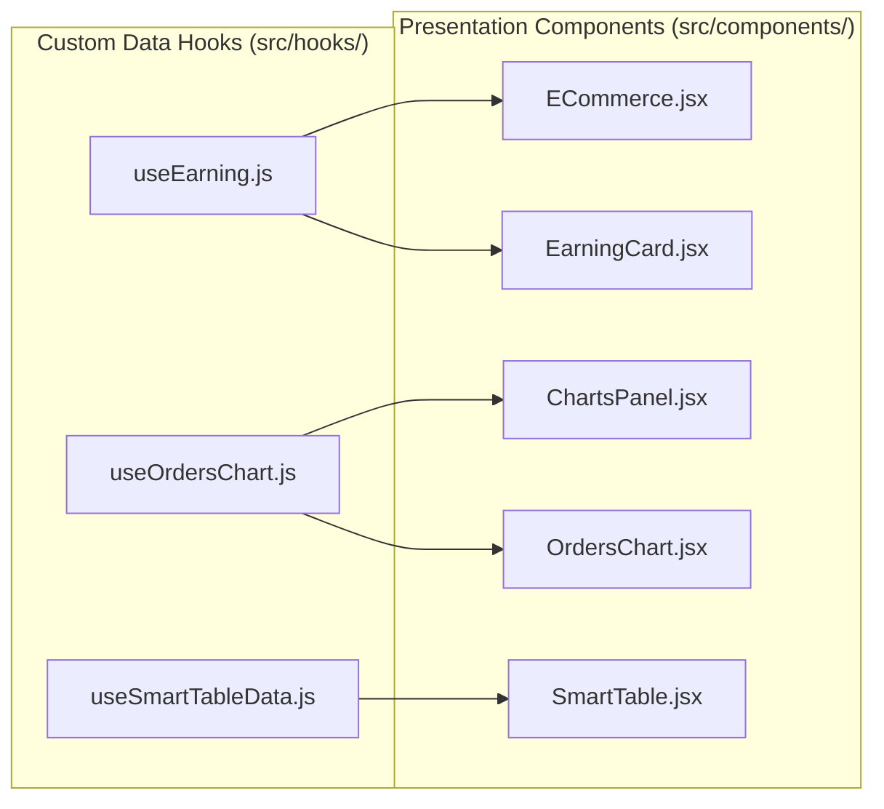

# 📐 MASTER ARCHITECTURE & LIVING COMPONENT BLUEPRINT

> **Status**: Auto-Synchronized | **Architecture**: Modular React 18 SPA + Custom Hook Data Layer

---

## 🏗️ C4 Level 1: System Context Diagram

---

## 🔗 C4 Level 3: Custom Hook Data Dependency Graph

---

## 🧩 Living Component Inventory Matrix

| Component Path | Domain Area | Status |
| :--- | :--- | :---: |
| `src/App.jsx` | **ROOT** | 🟢 Interactive Demo |
| `src/components/sections/Accordion.jsx` | **COMPONENTS** | 🟢 Interactive Demo |
| `src/components/sections/Alert.jsx` | **COMPONENTS** | 🟡 Static Showcase |
| `src/components/sections/AnimatedSearch.jsx` | **COMPONENTS** | 🟢 Interactive Demo |
| `src/components/sections/BubbleMaps.jsx` | **COMPONENTS** | 🟢 Interactive Demo |
| `src/components/sections/CalendarApp.jsx` | **COMPONENTS** | 🟢 Interactive Demo |
| `src/components/sections/CalendarKit.jsx` | **COMPONENTS** | 🟢 Interactive Demo |
| `src/components/sections/ChartPanelHeader.jsx` | **COMPONENTS** | 🟢 Interactive Demo |
| `src/components/sections/ChartPanelSummary.jsx` | **COMPONENTS** | 🟡 Static Showcase |
| `src/components/sections/ChartsPanel.jsx` | **COMPONENTS** | 🟢 Interactive Demo |
| `src/components/sections/Chat.jsx` | **COMPONENTS** | 🟢 Interactive Demo |
| `src/components/sections/CkEditor.jsx` | **COMPONENTS** | 🟢 Interactive Demo |
| `src/components/sections/CountryOrders.jsx` | **COMPONENTS** | 🟢 Interactive Demo |
| `src/components/sections/CountryOrdersChart.jsx` | **COMPONENTS** | 🟢 Interactive Demo |
| `src/components/sections/CountryOrdersMap.jsx` | **COMPONENTS** | 🟢 Interactive Demo |
| `src/components/sections/Datepicker.jsx` | **COMPONENTS** | 🟢 Interactive Demo |
| `src/components/sections/Dialogs.jsx` | **COMPONENTS** | 🟢 Interactive Demo |
| `src/components/sections/EarningCard.jsx` | **COMPONENTS** | 🟢 Interactive Demo |
| `src/components/sections/EarningCardBack.jsx` | **COMPONENTS** | 🟡 Static Showcase |
| `src/components/sections/EarningCardFront.jsx` | **COMPONENTS** | 🟡 Static Showcase |
| `src/components/sections/EarningLiveUpdateChart.jsx` | **COMPONENTS** | 🟡 Static Showcase |
| `src/components/sections/EarningPieChart.jsx` | **COMPONENTS** | 🟢 Interactive Demo |
| `src/components/sections/Echarts.jsx` | **COMPONENTS** | 🟢 Interactive Demo |
| `src/components/sections/ECommerce.jsx` | **COMPONENTS** | 🟡 Static Showcase |
| `src/components/sections/ElectricityCard.jsx` | **COMPONENTS** | 🟢 Interactive Demo |
| `src/components/sections/Footer.jsx` | **COMPONENTS** | 🟡 Static Showcase |
| `src/components/sections/FormButtons.jsx` | **COMPONENTS** | 🟢 Interactive Demo |
| `src/components/sections/FormInputs.jsx` | **COMPONENTS** | 🟢 Interactive Demo |
| `src/components/sections/FormLayouts.jsx` | **COMPONENTS** | 🟢 Interactive Demo |
| `src/components/sections/GoogleMaps.jsx` | **COMPONENTS** | 🟢 Interactive Demo |
| `src/components/sections/Grid.jsx` | **COMPONENTS** | 🟡 Static Showcase |
| `src/components/sections/Header.jsx` | **COMPONENTS** | 🟢 Interactive Demo |
| `src/components/sections/Icons.jsx` | **COMPONENTS** | 🟢 Interactive Demo |
| `src/components/sections/InfiniteList.jsx` | **COMPONENTS** | 🟢 Interactive Demo |
| `src/components/sections/KittenCard.jsx` | **COMPONENTS** | 🟡 Static Showcase |
| `src/components/sections/LeafletMaps.jsx` | **COMPONENTS** | 🟢 Interactive Demo |
| `src/components/sections/LegendChart.jsx` | **COMPONENTS** | 🟡 Static Showcase |
| `src/components/sections/List.jsx` | **COMPONENTS** | 🟡 Static Showcase |
| `src/components/sections/Login.jsx` | **COMPONENTS** | 🟢 Interactive Demo |
| `src/components/sections/Maps.jsx` | **COMPONENTS** | 🟢 Interactive Demo |
| `src/components/sections/NotFound.jsx` | **COMPONENTS** | 🟡 Static Showcase |
| `src/components/sections/NotificationDrawer.jsx` | **COMPONENTS** | 🟢 Interactive Demo |
| `src/components/sections/OrderModal.jsx` | **COMPONENTS** | 🟢 Interactive Demo |
| `src/components/sections/OrdersChart.jsx` | **COMPONENTS** | 🟢 Interactive Demo |
| `src/components/sections/Popover.jsx` | **COMPONENTS** | 🟢 Interactive Demo |
| `src/components/sections/profit-card/StatsCardBack.jsx` | **COMPONENTS** | 🟡 Static Showcase |
| `src/components/sections/profit-card/StatsCardFront.jsx` | **COMPONENTS** | 🟢 Interactive Demo |
| `src/components/sections/ProfitCard.jsx` | **COMPONENTS** | 🟢 Interactive Demo |
| `src/components/sections/ProfitChart.jsx` | **COMPONENTS** | 🟢 Interactive Demo |
| `src/components/sections/ProgressBar.jsx` | **COMPONENTS** | 🟡 Static Showcase |
| `src/components/sections/ProgressSection.jsx` | **COMPONENTS** | 🟢 Interactive Demo |
| `src/components/sections/Register.jsx` | **COMPONENTS** | 🟢 Interactive Demo |
| `src/components/sections/ResetPassword.jsx` | **COMPONENTS** | 🟢 Interactive Demo |
| `src/components/sections/RoomsCard.jsx` | **COMPONENTS** | 🟢 Interactive Demo |
| `src/components/sections/SearchInput.jsx` | **COMPONENTS** | 🟢 Interactive Demo |
| `src/components/sections/SecurityCameras.jsx` | **COMPONENTS** | 🟢 Interactive Demo |
| `src/components/sections/Settings.jsx` | **COMPONENTS** | 🟢 Interactive Demo |
| `src/components/sections/Sidebar.jsx` | **COMPONENTS** | 🟢 Interactive Demo |
| `src/components/sections/SlideOut.jsx` | **COMPONENTS** | 🟡 Static Showcase |
| `src/components/sections/SmartTable.jsx` | **COMPONENTS** | 🟢 Interactive Demo |
| `src/components/sections/SolarCard.jsx` | **COMPONENTS** | 🟢 Interactive Demo |
| `src/components/sections/Spinner.jsx` | **COMPONENTS** | 🟡 Static Showcase |
| `src/components/sections/StatsAreaChart.jsx` | **COMPONENTS** | 🟡 Static Showcase |
| `src/components/sections/StatsBarAnimationChart.jsx` | **COMPONENTS** | 🟡 Static Showcase |
| `src/components/sections/status-card/DeviceStatusCard.jsx` | **COMPONENTS** | 🟢 Interactive Demo |
| `src/components/sections/StatusCard.jsx` | **COMPONENTS** | 🟢 Interactive Demo |
| `src/components/sections/Stepper.jsx` | **COMPONENTS** | 🟢 Interactive Demo |
| `src/components/sections/Tabs.jsx` | **COMPONENTS** | 🟢 Interactive Demo |
| `src/components/sections/TemperatureCard.jsx` | **COMPONENTS** | 🟢 Interactive Demo |
| `src/components/sections/ThemeCustomizer.jsx` | **COMPONENTS** | 🟢 Interactive Demo |
| `src/components/sections/TinyMce.jsx` | **COMPONENTS** | 🟢 Interactive Demo |
| `src/components/sections/Toastr.jsx` | **COMPONENTS** | 🟢 Interactive Demo |
| `src/components/sections/Tooltip.jsx` | **COMPONENTS** | 🟢 Interactive Demo |
| `src/components/sections/traffic-reveal/TrafficBackCard.jsx` | **COMPONENTS** | 🟡 Static Showcase |
| `src/components/sections/traffic-reveal/TrafficFrontCard.jsx` | **COMPONENTS** | 🟢 Interactive Demo |
| `src/components/sections/TrafficBar.jsx` | **COMPONENTS** | 🟡 Static Showcase |
| `src/components/sections/TrafficBarChart.jsx` | **COMPONENTS** | 🟢 Interactive Demo |
| `src/components/sections/TrafficCardsHeader.jsx` | **COMPONENTS** | 🟡 Static Showcase |
| `src/components/sections/TrafficRevealCard.jsx` | **COMPONENTS** | 🟢 Interactive Demo |
| `src/components/sections/TreeGrid.jsx` | **COMPONENTS** | 🟢 Interactive Demo |
| `src/components/sections/Typography.jsx` | **COMPONENTS** | 🟡 Static Showcase |
| `src/components/sections/UserActivity.jsx` | **COMPONENTS** | 🟢 Interactive Demo |
| `src/components/sections/UserManagement.jsx` | **COMPONENTS** | 🟢 Interactive Demo |
| `src/components/sections/VisitorsAnalytics.jsx` | **COMPONENTS** | 🟢 Interactive Demo |
| `src/components/sections/VisitorsAnalyticsChart.jsx` | **COMPONENTS** | 🟢 Interactive Demo |
| `src/components/sections/VisitorsStatistics.jsx` | **COMPONENTS** | 🟡 Static Showcase |
| `src/components/sections/WeatherCard.jsx` | **COMPONENTS** | 🟢 Interactive Demo |
| `src/components/sections/Window.jsx` | **COMPONENTS** | 🟢 Interactive Demo |
| `src/components/ui/Badge.jsx` | **COMPONENTS** | 🟡 Static Showcase |
| `src/components/ui/Button.jsx` | **COMPONENTS** | 🟡 Static Showcase |
| `src/components/ui/Card.jsx` | **COMPONENTS** | 🟡 Static Showcase |
| `src/components/ui/CardHeader.jsx` | **COMPONENTS** | 🟡 Static Showcase |
| `src/components/ui/CircularProgress.jsx` | **COMPONENTS** | 🟡 Static Showcase |
| `src/components/ui/ClearableInput.jsx` | **COMPONENTS** | 🟢 Interactive Demo |
| `src/components/ui/FlipButton.jsx` | **COMPONENTS** | 🟢 Interactive Demo |
| `src/components/ui/FlipCard.jsx` | **COMPONENTS** | 🟡 Static Showcase |
| `src/components/ui/FormInput.jsx` | **COMPONENTS** | 🟢 Interactive Demo |
| `src/components/ui/GlassCard.jsx` | **COMPONENTS** | 🟡 Static Showcase |
| `src/components/ui/PeriodSelector.jsx` | **COMPONENTS** | 🟢 Interactive Demo |
| `src/components/ui/RevealCard.jsx` | **COMPONENTS** | 🟡 Static Showcase |
| `src/components/ui/ToggleSwitch.jsx` | **COMPONENTS** | 🟢 Interactive Demo |
| `src/components/ui/TrendBadge.jsx` | **COMPONENTS** | 🟡 Static Showcase |
| `src/context/AuthContext.jsx` | **CONTEXT** | 🟢 Interactive Demo |
| `src/context/ThemeContext.jsx` | **CONTEXT** | 🟢 Interactive Demo |
| `src/main.jsx` | **ROOT** | 🟡 Static Showcase |
