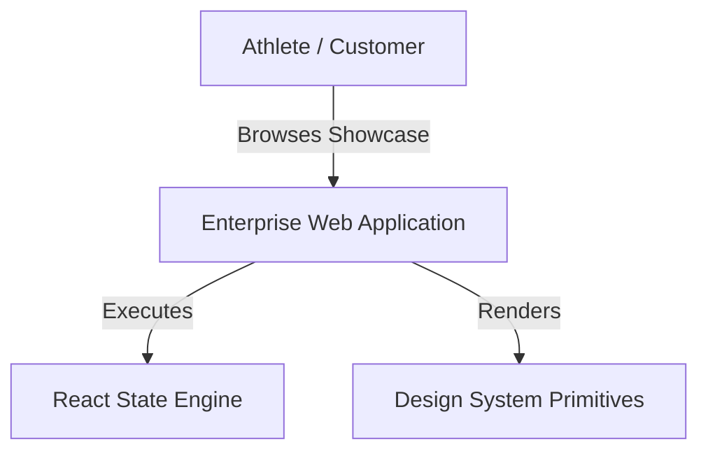

# 📐 MASTER ARCHITECTURE & LIVING COMPONENT BLUEPRINT

> **Status**: Auto-Synchronized | **Architecture**: Modular React SPA

---

## 🏗️ C4 Level 1: System Context Diagram

---

## 🧩 Living Component Inventory Matrix

| Component Path | Domain Area | Status |
| :--- | :--- | :---: |
| `src/App.jsx` | **ROOT** | 🟢 Active |
| `src/components/ui/Badge.jsx` | **COMPONENTS** | 🟢 Active |
| `src/components/ui/Button.jsx` | **COMPONENTS** | 🟢 Active |
| `src/components/ui/Card.jsx` | **COMPONENTS** | 🟢 Active |
| `src/components/ui/GlassCard.jsx` | **COMPONENTS** | 🟢 Active |
| `src/main.jsx` | **ROOT** | 🟢 Active |

---

*Last Auto-Synchronized: 2026-08-04T15:10:24.893Z*
