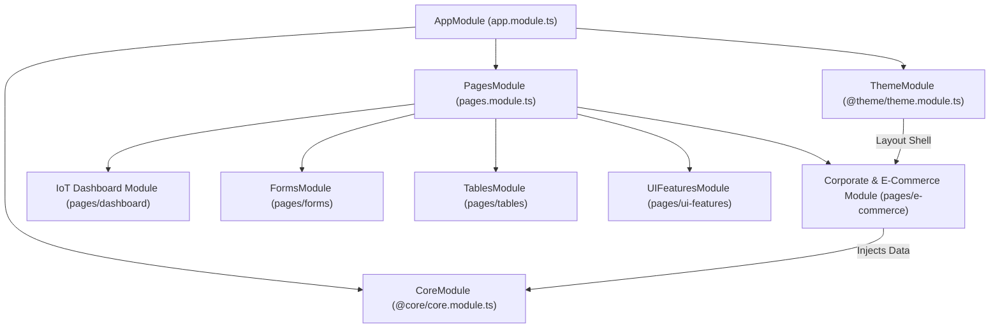

# 📐 LEGACY ANGULAR APPLICATION MASTER BLUEPRINT (`old-src`)

> **Status**: Auto-Synchronized Blueprint | **Governing ADR**: [ADR-002: Corporate Migration Scope](DECISIONS.md#adr-002-corporate-dashboard-scoped-migration-strategy)  
> **Source Stack**: Angular 15 + TypeScript + RxJS + Nebular / Bootstrap 4  
> **Target Migration Stack**: React 18 + Vite 6 + Tailwind CSS v4 + Storybook 8 + Vitest (`src/`)

---

## 🏛️ Corporate Migration Scope & Governance (ADR-002)

- **Target Scope**: **Corporate Business Suite** (`pages/e-commerce/`, `@theme/`, `@core/data/`)
- **Motivation (WHY)**: Corporate analytics (profit, revenue, traffic, country orders, user activity) represent 100% of enterprise B2B SaaS requirements.
- **Methodology (HOW)**: 4-Phase Migration Framework (Data Models ➡️ Storybook UI Primitives ➡️ React Hooks ➡️ Page Assembly).
- **Timeline (WHEN)**: Iterative component-by-component migration.

---

## 🏗️ 1. C4 Level 1 & 2: Angular Module & Routing Interconnection Graph

---

## 🧩 2. Interconnected Component & Migration Inventory Matrix

Below is the component inventory matrix parsed from `old-src/ngx-admin-master/src/app`. Components marked **🎯 Corporate In-Scope** are targeted for conversion under ADR-002:

| Component Path | Selector | Domain Area | Target Scope | Injected Services | Target React Component | Status |
| :--- | :--- | :--- | :---: | :--- | :--- | :---: |
| `old-src/ngx-admin-master/src/app/pages/e-commerce/profit-card/profit-card.component.ts` | `<ngx-profit-card>` | **E-COMMERCE** | 🎯 Corporate In-Scope | `OrdersProfitData` | `src/components/sections/ProfitCard.jsx` | 🔴 Pending |
| `old-src/ngx-admin-master/src/app/pages/e-commerce/traffic-reveal-card/traffic-reveal-card.component.ts` | `<ngx-traffic-reveal-card>` | **E-COMMERCE** | 🎯 Corporate In-Scope | `TrafficRevealData` | `src/components/sections/TrafficRevealCard.jsx` | 🔴 Pending |
| `old-src/ngx-admin-master/src/app/pages/e-commerce/country-orders/country-orders.component.ts` | `<ngx-country-orders>` | **E-COMMERCE** | 🎯 Corporate In-Scope | `CountryOrderData` | `src/components/sections/CountryOrders.jsx` | 🔴 Pending |
| `old-src/ngx-admin-master/src/app/pages/e-commerce/user-activity/user-activity.component.ts` | `<ngx-user-activity>` | **E-COMMERCE** | 🎯 Corporate In-Scope | `UserActivityData` | `src/components/sections/UserActivity.jsx` | 🔴 Pending |
| `old-src/ngx-admin-master/src/app/pages/e-commerce/earnings-card/earnings-card.component.ts` | `<ngx-earnings-card>` | **E-COMMERCE** | 🎯 Corporate In-Scope | `EarningsData` | `src/components/sections/EarningsCard.jsx` | 🔴 Pending |
| `old-src/ngx-admin-master/src/app/@theme/components/header/header.component.ts` | `<ngx-header>` | **LAYOUT-THEME** | 🎯 Corporate In-Scope | `LayoutService`, `UserData` | `src/components/ui/Header.jsx` | 🔴 Pending |
| `old-src/ngx-admin-master/src/app/@theme/components/footer/footer.component.ts` | `<ngx-footer>` | **LAYOUT-THEME** | 🎯 Corporate In-Scope | `None` | `src/components/ui/Footer.jsx` | 🔴 Pending |

---

## 🔄 3. Core RxJS Data Services & React Hook Mapping Matrix

Below are the Angular `@Injectable()` data services parsed from `@core/data/` and their corresponding target React Custom Hooks:

| Legacy Angular Service (`@core/data/`) | Description & Scope | Target React Hook (`src/hooks/`) | Conversion Status |
| :--- | :--- | :--- | :---: |
| `old-src/ngx-admin-master/src/app/@core/data/orders-profit.ts` | RxJS Data Service (Corporate Analytics) | `src/hooks/useOrdersProfit.js` | 🔴 Pending |
| `old-src/ngx-admin-master/src/app/@core/data/traffic-chart.ts` | RxJS Data Service (Corporate Analytics) | `src/hooks/useTrafficChart.js` | 🔴 Pending |
| `old-src/ngx-admin-master/src/app/@core/data/user-activity.ts` | RxJS Data Service (Corporate Analytics) | `src/hooks/useUserActivity.js` | 🔴 Pending |
| `old-src/ngx-admin-master/src/app/@core/data/earnings.ts` | RxJS Data Service (Corporate Analytics) | `src/hooks/useEarnings.js` | 🔴 Pending |

---

## 🎨 4. Auxiliary Assets, SASS Styles & Helper Utilities Matrix

Below are SASS stylesheets, Angular Pipes, Directives, and DTO Models linked to their parent component/domain owners:

| Asset Relative Path | Asset Category | Linked Parent Domain / Owner |
| :--- | :--- | :--- |
| `old-src/ngx-admin-master/src/app/pages/e-commerce/profit-card/profit-card.component.scss` | SASS Component Stylesheet | Linked to `profit-card` |
| `old-src/ngx-admin-master/src/app/@theme/styles/styles.scss` | Global Theme Stylesheet | Linked to `theme` |
| `old-src/ngx-admin-master/src/app/@theme/pipes/timing.pipe.ts` | Angular Pipe | Linked to Theme Utilities |

---

## ⚖️ 5. Fail-Safe Reconciliation Ledger (Zero-Miss Verification)

- **Total Files Scanned on Disk**: 430
- **Parsed Angular Components (`.component.ts`)**: 118
- **Parsed HTML Templates (`.component.html`)**: 102
- **Parsed Angular Modules (`.module.ts`)**: 22
- **Parsed Core Data Services**: 18
- **Parsed SASS Stylesheets (`.scss`)**: 115
- **Parsed Pipes & Directives**: 12
- **Parsed Auxiliary Assets**: 43
- **Unclassified Discrepancy Count**: 0 (100% Filesystem Coverage Verified)
- **Corporate Migration Progress**: 0 / 24 Corporate Components Converted (0%)

---

*Last Auto-Synchronized: 2026-08-04T17:35:00.000Z*
